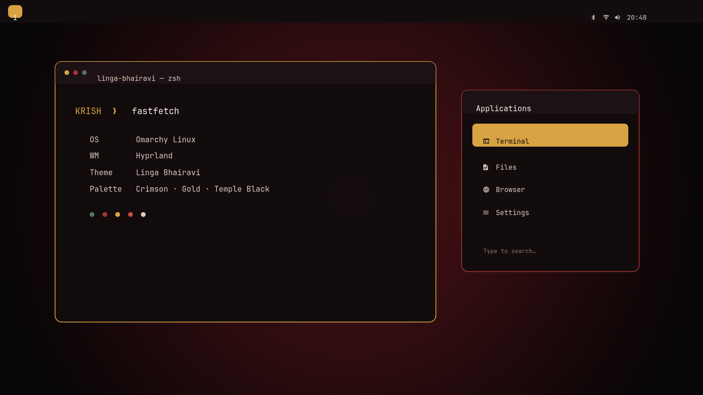

# Omarchy Linga Bhairavi Theme

An unofficial, devotional Omarchy theme inspired by Linga Bhairavi: deep temple
blacks, Devi crimson, kumkum red, turmeric gold, and restrained sacred green.



This community project is not affiliated with or endorsed by Isha Foundation.

## Install

```bash
omarchy theme install https://github.com/KrishJ4856/omarchy-linga-bhairavi-theme.git
```

Choose **Linga Bhairavi** when Omarchy asks which installed theme to activate.

## What it changes

- A warm, high-contrast terminal and application palette
- Gold active borders, focus states, sliders, toggles, and selections
- Dark crimson launcher, menu, popup, control-center, tooltip, notification,
  image-picker, authentication, and lock-screen surfaces
- Compact Hyprland gaps, softened corners, and a subtle temple-red shadow
- A custom transparent lock-screen mark and matching preview
- A restrained original 4K fallback gradient so a fresh install always has a
  valid background

The palette deliberately gives different roles to Devi's colors: crimson for
energy and selection, gold for focus and sacred accents, green for success,
and near-black brown for quiet background depth.

## Add personal wallpapers

The repository includes only its original dark-crimson fallback gradient.
Photographs found online are not bundled because this project does not own
their redistribution rights. Put any personally obtained Linga Bhairavi images in:

```text
~/.config/omarchy/backgrounds/linga-bhairavi/
```

Omarchy will include them in the theme's wallpaper rotation without modifying
this repository.

## Optional minimal Stuti widget

The companion in `extras/stuti-widget` adds a lotus to the right side of the
bar. Clicking it opens only the Stuti text and a **Sounds of Isha ↗** link.

After installing the theme:

```bash
cp -r ~/.config/omarchy/themes/linga-bhairavi/extras/stuti-widget \
  ~/.config/omarchy/plugins/krish.linga-bhairavi-stuti
```

Then enable it in the right status cluster:

```bash
omarchy plugin enable krish.linga-bhairavi-stuti --section right --after omarchy.tray
```

The included transcription contains the 33 qualities, the three concluding
sacred-name lines, and the final closing line. The widget also links to Isha's
[official Stuti page](https://isha.sadhguru.org/linga-bhairavi/in/en/sadhana/linga-bhairavi-stuti)
and the official [Sounds of Isha recording](https://www.youtube.com/watch?v=qEZVkptPHpo).

Omarchy plugins run with your user permissions. Review the small QML file
before enabling it, as you should with any third-party plugin.

## Inspect and customize

See [VISUAL-CHECK.md](VISUAL-CHECK.md) for a surface-by-surface checklist.
`sources/` contains the editable lock-screen SVG artwork. The canonical palette
lives in `colors.toml`, while `shell.*.toml` files tune individual shell surfaces.

Current Omarchy builds support `hyprland.conf`; this theme retains its
`hyprland.lua` override for installations that support Lua theme overrides. If
your installer omits it, the color and shell styling still apply normally.

## License

Theme code and original artwork are MIT-licensed. See
[ASSETS-LICENSE.md](ASSETS-LICENSE.md) for the wallpaper policy.
